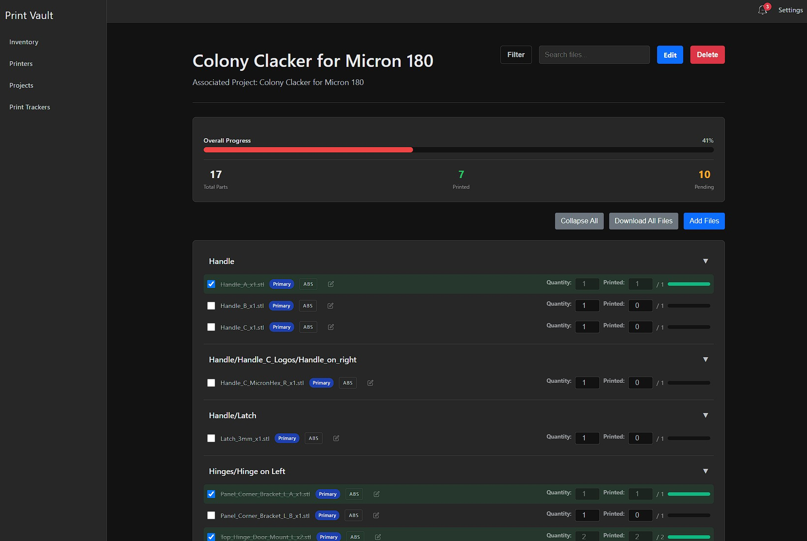

# Print Vault

[](https://www.repostatus.org/#wip)

[](https://github.com/shaxs/printvault)

> The Self-Hosted Vault for Your 3D Printing Ecosystem.

Print Vault is a modern, open-source, and self-hostable application designed for 3D printing enthusiasts. Finally, you can manage your printers, track your parts inventory, and organize all of your projects in one clean, powerful, and private application that you control.

---

## About The Project

Print Vault started as a simple solution to a personal problem: managing a growing collection of 3D printing parts. After an initial version built with AppSheet proved difficult to share, it became clear that the 3D printing community deserved a better tool—one that wasn't tied to a third-party service and could be truly owned by the user.

This project was redesigned from the ground up to be a modern, completely self-hostable application. It's built to solve a real-world need, offering the power and privacy that comes from running your own service, on your own hardware.

### Mobile-First Design

Print Vault was initially built with a core principle: **you should be able to add a new inventory item in 30 seconds or less, right from your phone.** Whether you're in your workshop, at the store, or organizing parts, Print Vault's PWA design ensures quick, efficient data entry from any device. No more returning to your computer to update your inventory—just pull out your phone, tap the app, and you're done.

### Screenshots

|                                Inventory Management                                 |                                               Print Tracker                                               |                                                Printer Details                                                |                                            Project Tracking                                            |
| :---------------------------------------------------------------------------------: | :-------------------------------------------------------------------------------------------------------: | :-----------------------------------------------------------------------------------------------------------: | :----------------------------------------------------------------------------------------------------: |
|  |  |  |  |

## Key Features

- **Comprehensive Inventory Tracking:** Stop guessing how many screws you have left. Track electronic components, hardware, and every part in your collection. Get low-stock alerts and always know what you have on hand.

- **Detailed Printer Management:** Keep a detailed record of every mod and upgrade, track maintenance schedules with reminders, and store important files and links for each of your unique printers.

- **Organized Project Tracking:** Move beyond folders of STLs. Organize your prints into projects, linking the exact inventory parts and printers used. Track project status and keep all related files and notes in one cohesive view.

* **Smart Print Tracker:** Automatically import entire **GitHub repositories** with one click, manually add files from **direct download URLs**, or **upload files from your computer**. Mix and match all three methods in a single tracker. Organize files by category, track your print queue, and mark items as printed. Keep your entire printing pipeline organized in one place.

  > 💡 **Tip:** Creating trackers works best on a desktop or tablet. Use your phone to view trackers and mark items as printed.

## Progressive Web App (PWA)

Print Vault is designed as a **Progressive Web App**, meaning it works like a native mobile app while running in your browser:

- **Add to Home Screen:** Install Print Vault on your phone or tablet for instant access with a single tap
- **Lightning-Fast Loading:** Optimized for quick access - add new inventory items in under 30 seconds
- **Camera Integration:** Snap photos of parts directly from your phone when adding inventory
- **Mobile-First Design:** Built from the ground up for operation on mobile devices
- **Access Anywhere:** Connect via local network at home or securely over the internet with Tailscale (or other proxy)

**Best Experience by Device:**

- **Phone**: Perfect for inventory management, viewing trackers, and marking prints as complete
- **Tablet/Desktop**: Recommended for creating new trackers, managing mods, and complex file configuration

**To Install on Mobile:**

1. Access Print Vault via HTTPS (use Tailscale guide for secure access)
2. Tap your browser's menu (Safari: Share → Add to Home Screen, Chrome: ⋮ → Add to Home Screen)
3. Print Vault now appears as an app icon on your home screen!

> **Note:** PWA features require HTTPS. Follow the Tailscale guide below for easy, secure HTTPS setup.

## Tech Stack

Print Vault is powered by a modern, open-source stack:

- **Backend:** Django & Django REST Framework
- **Frontend:** Vue.js
- **Database:** PostgreSQL
- **Deployment:** Docker

## A Note from the Author

As a technical program manager who has been leading software projects for 20 years, and a passionate maker, I architected the entire system, defined the features, and guided the development process. However, I am not an engineer. The core challenge was translating the technical blueprint into production-ready code, which was accomplished using AI coding engines (Gemini 2.5 Pro and GitHub CoPilot).

This project is a tool built by a maker, for makers, and is intended for personal use. It may not be the most efficient, most definitely has undiscovered bugs, and may not be the most secure.

## Installation

This guide will walk you through setting up Print Vault on a server using Docker and Docker Compose.

### Prerequisites

Before you begin, you will need a server (such as a Proxmox LXC container, a VPS, or a Raspberry Pi) with the following software installed:

- **Git**
- **Docker**
- **Docker Compose**

---

## Guide 1: Standard Installation (HTTP)

This method will get your Print Vault instance running and make it accessible on your local network.

### Step 1: Clone the Repository

Connect to your server's terminal (e.g., via SSH) and clone the Print Vault source code.

```bash
git clone https://github.com/shaxs/print-vault.git
cd print-vault
```

### Step 2: Configure Your Environment

Print Vault is configured using a `.env` file. A template is provided to make this easy.

1. **Copy the Template:** Create your personal configuration file by copying the example.

```bash
cp .env.example .env
```

2. **Edit the `.env` File:** Open the new `.env` file with a text editor (like `nano .env`) and fill in your details.

```env
# Print Vault Environment Variables
# This file contains sensitive information and should NOT be shared.

# 1. Django Secret Key
# Generate a new key here: https://djecrety.ir/
DJANGO_SECRET_KEY='your-super-secret-key-goes-here'

# 2. Debug Mode
# Set to False in production for security
DJANGO_DEBUG='False'

# 3. PostgreSQL Database Username
POSTGRES_USER='postgres'

# 4. PostgreSQL Database Password
# It's highly recommended to change this from the default.
POSTGRES_PASSWORD='a-new-secure-password'

# 5. Application Hostname/IP
# This should be the IP address of your server.
APP_HOST='192.168.1.100'

# 6. Allowed Hosts
# Comma-separated list of allowed hostnames/IPs (no spaces!)
ALLOWED_HOSTS='192.168.1.100,localhost,127.0.0.1'

# 7. Application Port
# The external port the application will be accessible on.
APP_PORT='5173'
```

### Step 3: Create Data Directories

These folders will persistently store your application's database and your uploaded photos and files, keeping them safe even when the containers are updated.

```bash
mkdir -p ./data/postgres
mkdir -p ./data/media
```

### Step 4: Build and Run the Application

This single command will build the Docker images and start all the necessary services in the background.

```bash
docker compose up --build -d
```

The first time you run this, it may take several minutes to download the base images and build the application.

### Step 5: Access Print Vault

That's it! Your instance of Print Vault is now running. You can access it in your web browser by navigating to the IP address and port you configured in your `.env` file.

**Example:** `http://192.168.1.100:5173`

---

## Upgrading Print Vault

When a new version of Print Vault is released, follow these steps to safely upgrade your installation. **Always create a backup before upgrading!**

### Step 1: Backup Your Data (REQUIRED)

Before pulling any updates, create a backup from within the application:

1. **In-App Backup:** Open Print Vault in your browser
2. Navigate to **Settings → Data Management**
3. Click **"Export Data"** and save the backup ZIP file to your computer
4. **Important:** Keep this backup safe! It contains all your data and uploaded files

### Step 2: Backup Database (Additional Safety)

For extra safety, also create a direct database backup:

```bash
# SSH into your server
cd /path/to/print-vault

# Create backup directory if it doesn't exist
mkdir -p backups

# Backup PostgreSQL database
# Note: Database name is 'postgres' (default) and username is 'postgres' (or your POSTGRES_USER from .env)
docker compose exec db pg_dump -U postgres postgres > backups/printvault_backup_$(date +%Y%m%d_%H%M%S).sql

# Verify backup was created
ls -lh backups/
```

### Step 3: Pull Latest Changes

```bash
# Pull the latest version from GitHub
git pull origin main

# Or, for a specific branch/version:
# git pull origin feature/dashboard-alerts
```

### Step 4: Rebuild and Restart Containers

**Important:** Rebuild the containers with `--no-cache` to ensure the latest code is loaded. This prevents issues with cached Docker layers containing outdated code.

```bash
# Stop containers
docker compose down

# Rebuild with latest code using --no-cache (use sudo if you get permission errors)
docker compose up -d --build --no-cache

# If you get "permission denied" errors for data/postgres:
sudo docker compose up -d --build --no-cache

# Check that all containers started successfully
docker compose ps

# All three containers should show "Up" status:
# - print-vault-backend-1
# - print-vault-frontend-1
# - print-vault-db-1
```

**Why `--no-cache`?** When Docker builds images, it caches layers to speed up builds. During upgrades, cached layers might contain old code, causing version mismatches or bugs. Using `--no-cache` forces a fresh build with the latest code.

### Step 5: Verify Migrations Were Applied

Migrations are automatically applied during container startup. Verify they completed:

```bash
# Check migration status (use sudo if you built with sudo)
docker compose exec backend python manage.py showmigrations inventory

# All migrations should be marked [X] (applied)
# If you see [ ] (not applied), the container startup failed to run migrations

# You can manually apply if needed:
docker compose exec backend python manage.py migrate

# View logs to check for any errors
docker compose logs backend --tail 50
```

**Note:** You don't need to run `makemigrations` - migration files are included in the repository. You also don't need to manually run `migrate` in most cases - the entrypoint script does this automatically when the container starts.

### Step 6: Verify Upgrade

1. Access Print Vault in your browser
2. Check that all your data is present
3. Test new features mentioned in the release notes
4. Check both light and dark modes work correctly

### Rollback Instructions (If Needed)

If something goes wrong, you can rollback to the previous version:

```bash
# Stop containers
docker compose down

# Checkout previous version
git checkout <previous-commit-hash>
# Or: git checkout main (if you were testing a feature branch)

# Restore database backup
docker compose up -d db
cat backups/printvault_backup_YYYYMMDD_HHMMSS.sql | docker compose exec -T db psql -U postgres postgres

# Rollback migrations to previous state (if needed)
docker compose exec backend python manage.py migrate inventory <previous_migration_number>

# Restart all services
docker compose up -d --build
```

**Alternative: Restore from In-App Backup**

1. Install a fresh instance of Print Vault at the previous version
2. Navigate to **Settings → Data Management**
3. Click **"Import Data"** and upload your backup ZIP file
4. All your data and files will be restored

### Checking for Updates

To see what's new in each release:

1. Visit the [Releases page](https://github.com/shaxs/print-vault/releases) on GitHub
2. Read the release notes for new features and breaking changes
3. Check if database migrations are required (mentioned in release notes)

### Common Upgrade Issues

**Problem: "permission denied" when building containers**

```bash
# Error: error from sender: open /home/user/print-vault/data/postgres: permission denied
# Solution: Use sudo for Docker commands
sudo docker compose up -d --build
```

**Problem: Migrations not showing up**

```bash
# This usually means migrations were already applied automatically on container startup
# Verify with:
docker compose exec backend python manage.py showmigrations inventory

# All recent migrations should be marked [X]
# If containers built successfully, migrations were applied
```

**Problem: Container won't start after upgrade**

```bash
# Check logs for errors:
docker compose logs backend --tail 100
docker compose logs frontend --tail 50

# Common issues:
# - Migration errors (check backend logs)
# - Missing environment variables (check .env file)
# - Port conflicts (check if another service is using the port)
```

**Problem: "Database does not exist" when backing up**

```bash
# Make sure you're using the correct database name: 'postgres' (not 'printvault')
docker compose exec db pg_dump -U postgres postgres > backup.sql
```

**Problem: Changes not appearing after rebuild**

```bash
# Make sure you actually rebuilt (not just restarted):
docker compose down
docker compose up -d --build  # --build is important!

# Clear browser cache or hard refresh (Ctrl+F5 / Cmd+Shift+R)
```

---

## Setup Secure Remote Access with Tailscale (Optional)

This guide builds upon the standard installation and adds secure HTTPS access, allowing you to connect to your Print Vault from anywhere. This method also enables the PWA "Add to Home Screen" feature on mobile devices.

### Prerequisites

- Print Vault is already installed and running using the **Standard Installation** guide above.
- A [Tailscale](https://tailscale.com/) account (a free personal account is sufficient).
- The Tailscale client is installed and running on the same server as your Print Vault application.

### Configuration Steps

**1. Authenticate Your Server with Tailscale**

First, ensure the Tailscale client on your server is running and authenticated to your account.

```bash
# Start the client and enable the SSH server
tailscale up --ssh

# Follow the URL provided to log in and authorize the machine.
```

**2. Configure Tailscale Serve**

Run the following command on your server. This tells your Tailscale client to act as a secure reverse proxy for your Print Vault container.

- Replace `5173` with the `APP_PORT` you set in your `.env` file.
- The `--bg` flag runs the service in the background, so it will persist even if you disconnect your SSH session.

```bash
tailscale serve --bg http://127.0.0.1:5173
```

**3. Update Your Configuration**

Edit your `.env` file and add your Tailscale domain to `ALLOWED_HOSTS`:

```bash
nano .env
```

Add your Tailscale domain to the `ALLOWED_HOSTS` line (no spaces between items!):

```env
ALLOWED_HOSTS='192.168.1.100,localhost,127.0.0.1,your-server-name.your-tailnet.ts.net'
```

Replace `your-server-name.your-tailnet.ts.net` with your actual Tailscale hostname.

Restart the backend to apply the changes:

```bash
docker compose restart backend
```

**4. Access Print Vault Securely**

Tailscale will now handle all the HTTPS and SSL certificate management for you. It will make your application available at a secure, private URL based on your server's Tailscale name.

The URL will look like this: `https://<your-server-name>.<your-tailnet>.ts.net`

You can now use this HTTPS address to access Print Vault from any device that is also logged into your Tailscale network.

---

## Troubleshooting

### Permission Denied Errors

If you encounter errors like:

```
target backend: failed to solve: error from sender: open /home/pi/print-vault/data/postgres: permission denied
```

This means Docker doesn't have the necessary permissions to create or write to the data directories. This typically happens when running Docker commands as a non-root user.

**Solution:** Run Docker commands with `sudo`:

```bash
sudo docker compose up -d
sudo docker compose restart backend
sudo docker compose logs backend
```

**Alternative:** Add your user to the `docker` group (requires logout/login to take effect):

```bash
sudo usermod -aG docker $USER
```

After logging out and back in, you can run Docker commands without `sudo`.

### 400 Bad Request Errors

If you're getting 400 errors when accessing Print Vault via Tailscale or a custom domain:

1. Make sure your domain is added to `ALLOWED_HOSTS` in `.env`
2. Ensure there are no spaces in the `ALLOWED_HOSTS` list
3. Restart the backend: `docker compose restart backend`
4. Check logs: `docker compose logs backend`

### PWA Not Installing

- PWA features require HTTPS
- Use the Tailscale guide for easy HTTPS setup
- Some browsers require the site to be visited multiple times before showing the "Add to Home Screen" prompt
- On iOS, you must use Safari to install PWAs

### Application Won't Start

Check the logs for errors:

```bash
docker compose logs backend
docker compose logs frontend
```

Common issues:

- Missing required environment variables in `.env`
- Port conflicts (another service using port 5173 or 8000)
- Docker service not running

---

## Contributing

This project is primarily for personal use, but suggestions and bug reports are welcome! Please open an issue on GitHub.

## License

Print Vault is licensed under the [GNU Affero General Public License v3.0 (AGPL-3.0)](LICENSE).

### What this means:

- ✅ **Free for self-hosting** - Personal and commercial use
- ✅ **Modify and share** - You can fork and improve
- ⚠️ **SaaS restrictions** - If you host Print Vault as a service for others, you must open source your modifications

For commercial licensing inquiries, please [open an issue](https://github.com/shaxs/print-vault/issues).
