# Filament Guide

**Print Vault** — User Documentation
**Feature**: Filament / Material Management
**Last Updated**: 2026-07-09

---

## What Is the Filament System?

The Filament system is a two-tier way to track 3D printing filament: reusable **Materials** (the spec sheet for a filament — brand, type, color, print settings) and **Filament Spools** (the physical rolls you actually own, with weight/quantity, location, and status). Splitting these apart means you fill in a filament's brand, temperatures, and pricing once, then create as many physical spools against it as you buy.

Core capabilities:

- **Material Blueprints** — brand-specific filament specs (e.g. "Sunlu Lavender PLA+2.0"): brand, base material type, diameter, color(s), print temps, density, vendor/pricing, low-stock threshold, notes, and photos
- **Generic Materials** — bare base material types (PLA, PETG, ABS, etc.) with no brand or spec attached, used as the "Material Type" on Quick Add spools and as the required **Base Material Type** every Blueprint is built on
- **Filament Spools** — physical inventory, created either **From Blueprint** (inherits the blueprint's color/specs) or as a standalone **Quick Add** spool (its own name/brand/material/color, no blueprint required)
- **Hybrid quantity/weight tracking** — unopened spools are tracked by count ("3 spools"), opened spools are tracked by weight in grams with an automatic remaining-percentage bar
- Six-state spool lifecycle: **New/Unopened → Opened → In Use → Low → Empty → Archived**
- Location tracking (a spool lives in a **Storage Location** or is **Assigned to a Printer**, never both) plus optional Project association
- Low-stock alerting and Favorites at the Material Blueprint level
- Dashboard widgets surfacing low-stock materials, spools currently in use, and favorited materials

> **Note**: Filament is a different feature from **Inventory**. Inventory tracks general parts and supplies; Filament is a dedicated system for spool-level weight/quantity tracking, print temperatures, and per-spool location/printer/project assignment.

---

## Getting Started

Open **Filament** from the sidebar (route `/filaments`). This lands you on a tabbed page with three tabs: **Spools**, **Blueprints**, and **Generic Materials**. Every tab shares the same header toolbar: **Filter**, **Columns** (choose which table columns are visible), a **Search** box, and a blue **Add** button.

[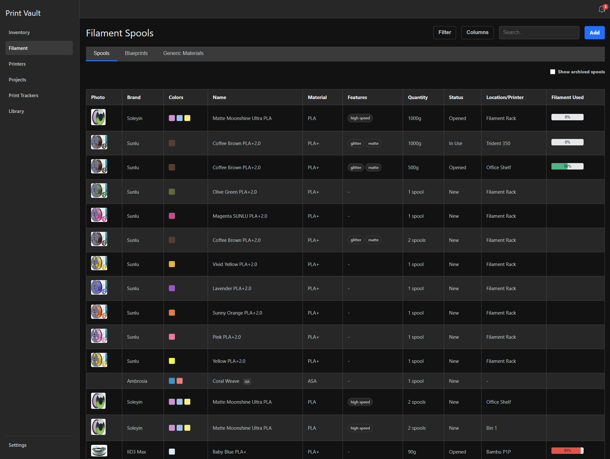](images/fil1.png)

The **Spools** tab is the default view — one row per spool record. An opened spool (tracked by weight) always gets its own row, but an unopened batch of identical spools (e.g. "4 spools" of the same brown PLA) can share a single row with a **Quantity** count rather than one row per physical roll — see [Creating a Filament Spool](#creating-a-filament-spool) for how unopened batches work. A **Show archived spools** checkbox (top right, above the table) hides archived spools by default.

---

## Material Blueprints vs. Generic Materials

Both live under the **Filament** tabs, but they serve different purposes:

- A **Material Blueprint** is brand-specific: it requires a **Brand** and a **Base Material Type**, and carries full specs — color(s), diameter, print temperatures, density, vendor/pricing, and a low-stock threshold. Blueprints show up in the **Blueprints** tab.
- A **Generic Material** is just a bare base type name — "PLA", "PETG", "ABS" — with no brand, color, or specs. Generic Materials show up in the **Generic Materials** tab as a simple name-only list, and exist mainly so Blueprints have something to point their **Base Material Type** at, and so Quick Add spools have a **Material Type** to pick from without requiring a full blueprint.

[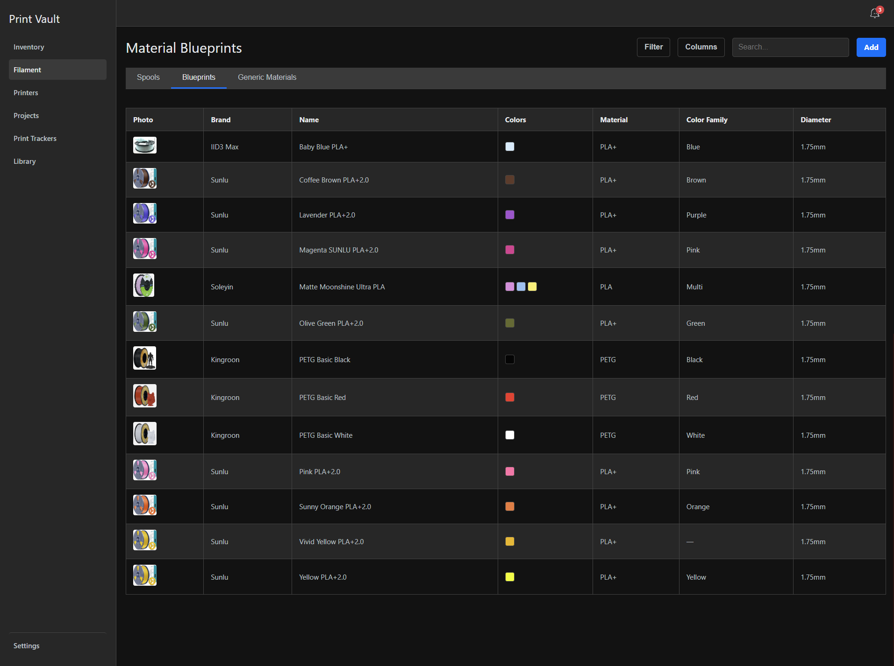](images/fil5.png)

[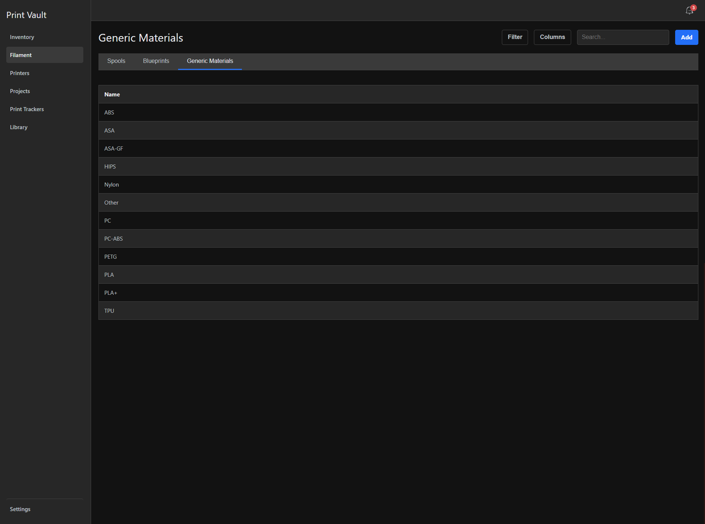](images/fil12.png)

> **Tip**: Print Vault ships with 12 built-in generic base types (ABS, ASA, ASA-GF, HIPS, Nylon, Other, PC, PC-ABS, PETG, PLA, PLA+, TPU). You can add your own, or edit/delete existing ones, from **Settings → Materials** — this is the same master list that populates the Base Material Type and Material Type dropdowns everywhere in the Filament system.

[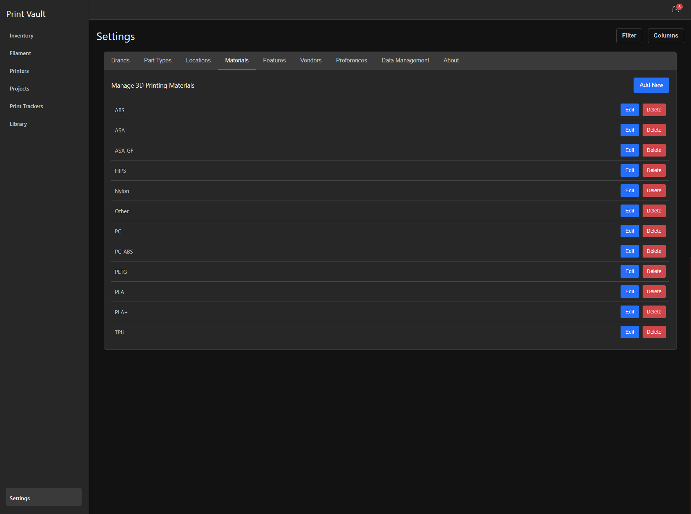](images/fil13.png)

---

## Creating a Material

Click **Add** from the Blueprints or Generic Materials tab to open **Add New Material**. The first choice is **Material Type**:

- **Blueprint (Brand-Specific Filament)** — the full form (see below)
- **Generic Material (Base Type)** — a minimal form: just **Name \*** and **Notes**

[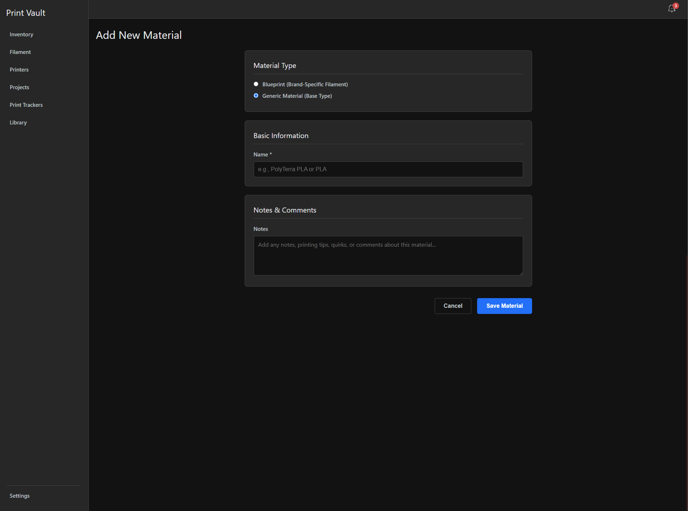](images/fil11.png)

For a **Blueprint**, the form is organized into sections:

- **Basic Information** — Name\*, Brand\* (type-to-search, taggable — creates a new brand on the fly), Base Material Type\* (same, taggable), Features (taggable multiselect, e.g. "matte", "high speed", "glitter" — free-form tags you define), a Main Photo upload, and an Additional Photos gallery with optional captions
- **Specifications** — Diameter (1.75mm / 2.85mm / 3.00mm), Standard Spool Weight (grams), Empty Spool Weight (grams, used to calculate accurate remaining-filament percentages)
- **Color Information** — Color Type: **Single Color** or **Multi-Color (Gradient/Blend)** (multi-color requires at least 2 colors). Each color has a native color-picker swatch plus a hex text field. **Primary Color Family** groups the blueprint into one of 13 families (Red, Orange, Yellow, Green, Blue, Purple, Pink, Brown, Black, White, Gray, Clear/Natural, Multi-Color) for filtering
- **Print Settings (Optional)** — Nozzle Temp Min/Max, Bed Temp Min/Max, Material Density (g/cm³, used for length/volume calculations)
- **Vendor & Pricing** — Vendor (taggable), Vendor Link (a URL to where you buy it), Price Per Spool
- **Advanced** — an **Enable Low Stock Alerts** checkbox gating a Low Stock Threshold (spool count), and a TDS Value (HueForge translucency value, optional)
- **Notes & Comments**

[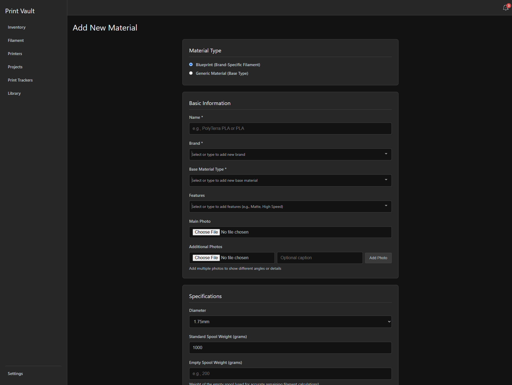](images/fil10.png)

Buttons: **Cancel**, **Save & Add Spool** (green — saves the blueprint and jumps straight into creating a spool from it), **Save & Clone** (purple — saves and reopens the create form pre-filled with most fields, so you can quickly add a color variant), **Save Material** (blue).

---

## The Material Detail View

Click into any Blueprint to see its detail page: a **Material Photos** card, **Material Details** (brand, material type, features, diameter, spool weight, empty spool weight, color swatches, color family), and — only shown when set — **Purchase Info** (vendor + price), **Print Settings** (temps, density, TDS), **Stock Settings** (low stock threshold), and **Notes**.

[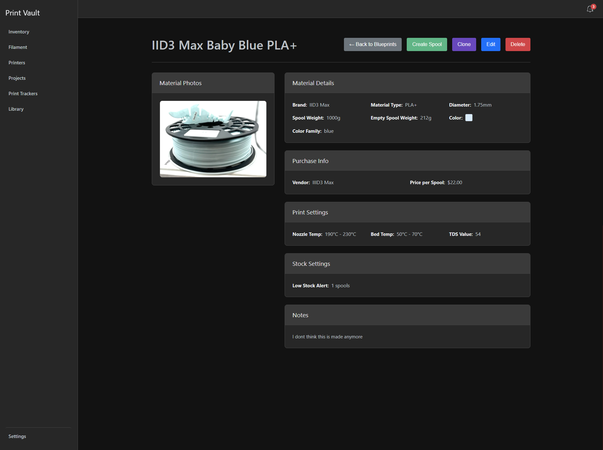](images/fil6.png)

Header buttons: **← Back to Blueprints**, **Create Spool** (green — jumps to spool creation with this blueprint pre-selected), **Clone** (purple), **Edit** (blue), **Delete** (red — deleting a blueprint does **not** delete spools that use it; they'll need to be reassigned to a different blueprint afterward).

Next to the blueprint's name at the top of the page is a **☆/★ favorite toggle** — click it to mark this Blueprint as a favorite (or click again to remove it). Only Blueprints can be favorited (Generic Materials can't); you can have up to 5 favorites at a time. Favorited Blueprints show a ★ in the **Blueprints** list's Favorite column and populate the Dashboard's **⭐ Favorites** widget (see [Dashboard Widgets](#dashboard-widgets)).

> 📷 **Screenshot needs updating** — fil6.png predates the favorite toggle

---

## Editing a Material

Click **Edit** from the detail view. The form mirrors Create, with one difference: **Material Type is locked** ("Material type cannot be changed after creation") — you can't flip a Blueprint into a Generic Material or vice versa after the fact.

[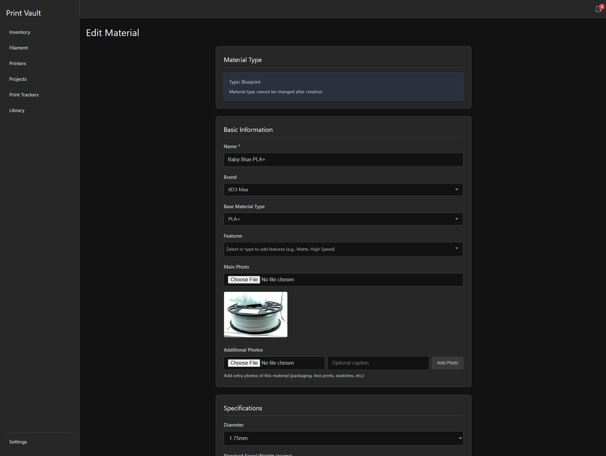](images/fil7a.png)

[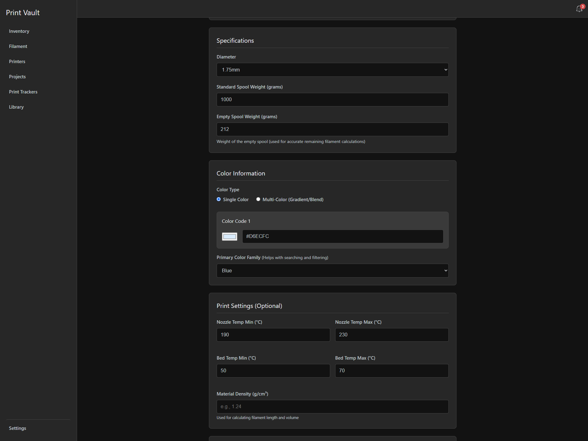](images/fil7b.png)

[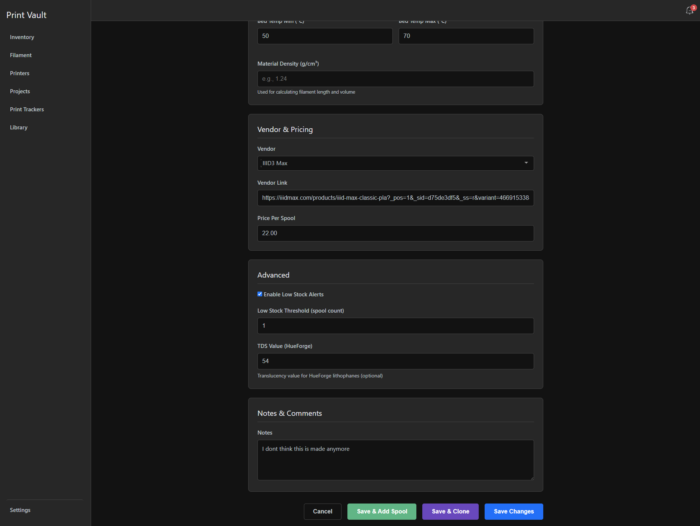](images/fil7c.png)

---

## Creating a Filament Spool

Click **Add** from the Spools tab (or **Create Spool** from a Material's detail page) to open **Add New Filament Spool**. Choose a **Creation Mode**:

- **From Blueprint** — select an existing Material Blueprint\*; only brand-specific materials are shown (a link offers to create a blueprint if you don't have one yet). A preview box shows the blueprint's color swatch(es) and name.
- **Quick Add** — a one-off spool with no blueprint: Name\*, Brand, Material Type\* (from your Generic Materials), Color Type (Single/Multi with the same color-picker + Color Family control as a Blueprint), Spool Weight (defaults to 1000g), and a collapsible **Print Settings (Optional)** section (nozzle/bed temp, density).

[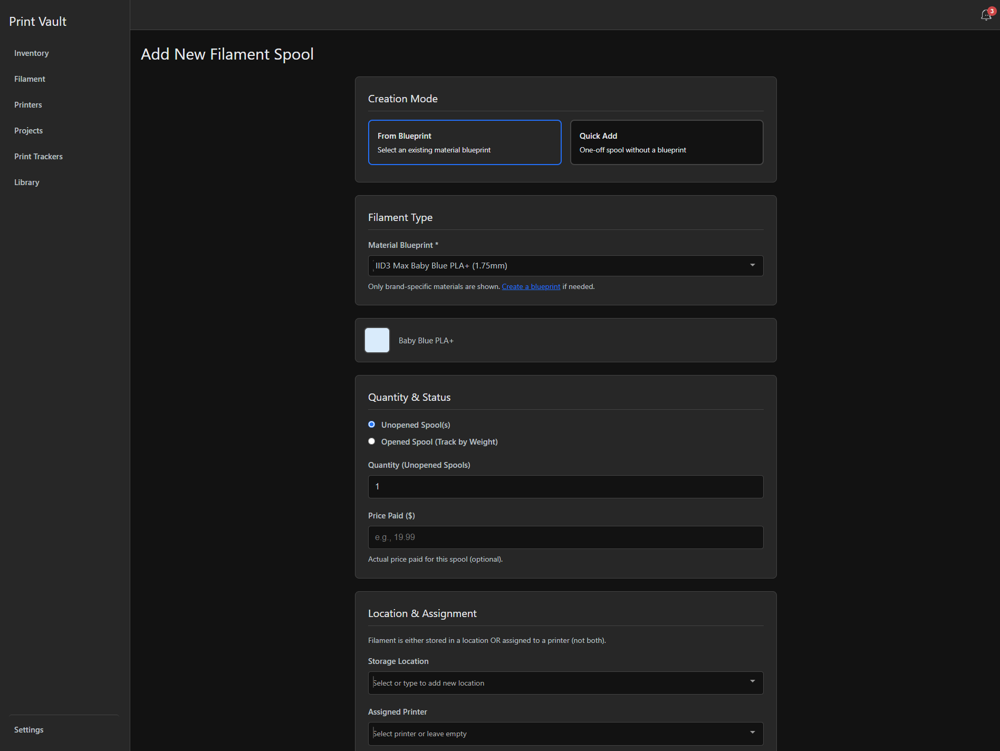](images/fil8a.png)

[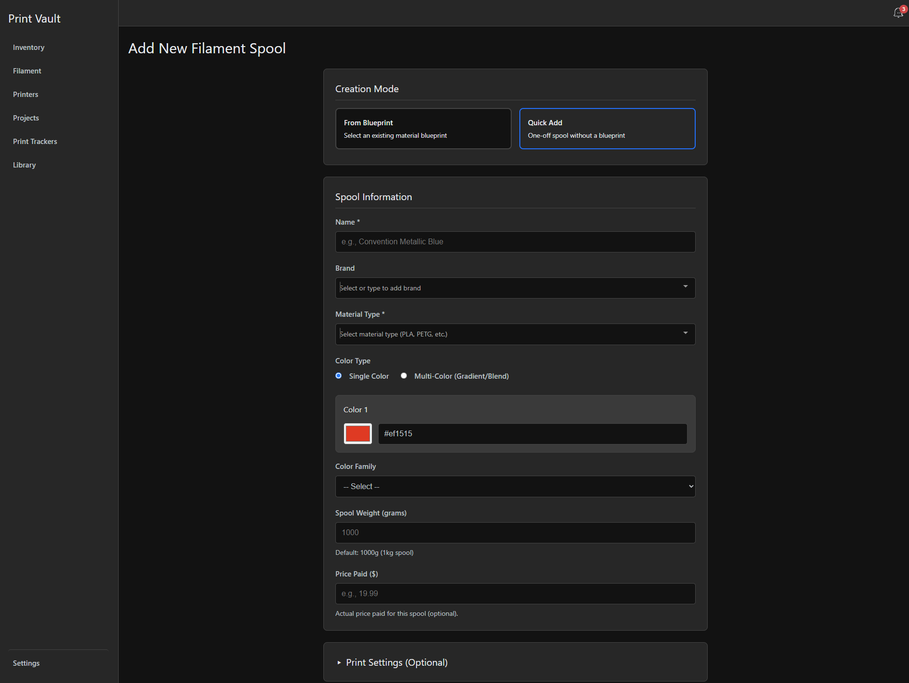](images/fil9a.png)

Both modes share the rest of the form:

- **Quantity & Status** — radio toggle between **Unopened Spool(s)** (a Quantity field — you're logging N identical unopened spools as one batch) and **Opened Spool (Track by Weight)** (Initial/Current Weight fields instead), plus Price Paid
- **Location & Assignment** — a note that a spool is stored in a **Storage Location** *or* assigned to a **Printer**, never both (choosing one clears the other), plus an optional **Associated Project**
- **Additional Details** — NFC Tag ID (a free-text identifier field for your own tagging/labeling system) and Notes

[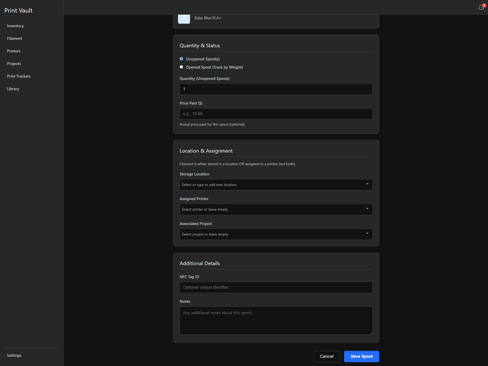](images/fil8b.png)

[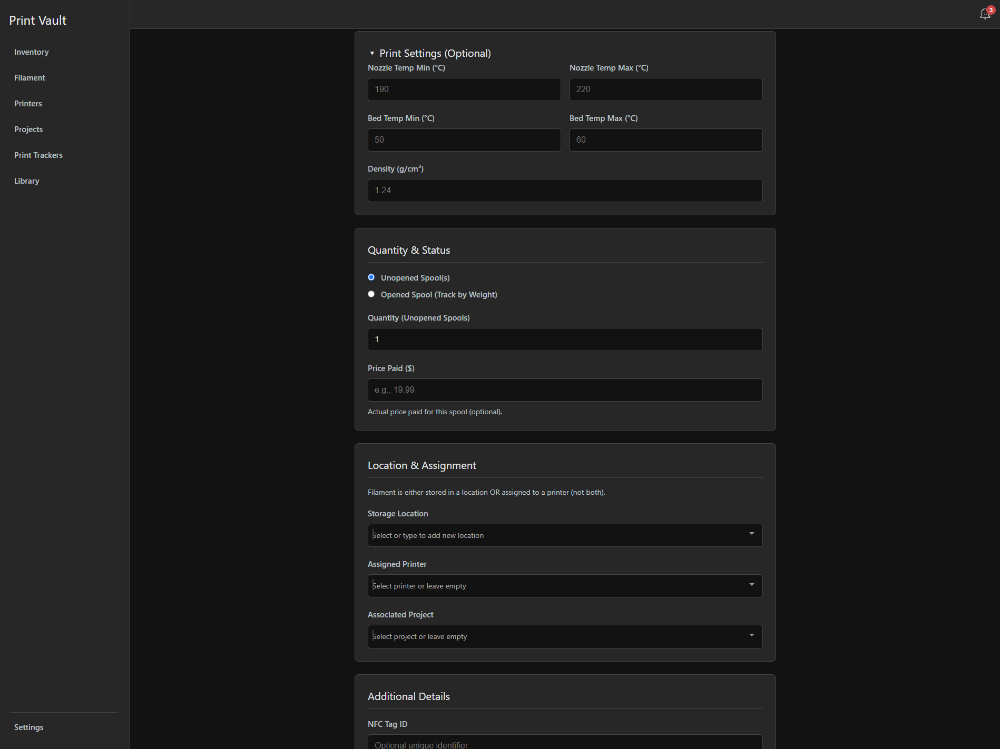](images/fil9b.png)

---

## The Spool Detail View

Click into any spool to see **Spool Details** (brand, material, features, diameter, status badge, color swatches, date added, a link back to the Blueprint if applicable), **Weight & Quantity** (current/initial weight with a remaining-percentage progress bar for opened spools, or a plain count for unopened batches), and — when set — **Location & Assignment**.

[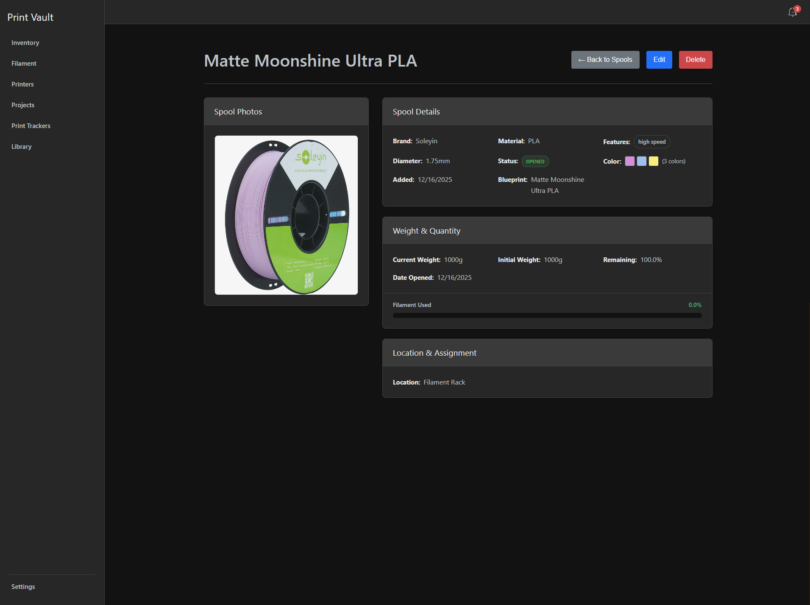](images/fil2.png)

Header buttons: **← Back to Spools**, **Edit**, **Delete**.

---

## Editing a Spool

Click **Edit** to open **Edit Spool**. For a Blueprint-based spool, the **Filament Type** section shows the blueprint's color swatches and name with a link to view/edit that blueprint directly (to change *which* blueprint a spool uses, use the Material Blueprint dropdown itself — the color box is a shortcut, not the only way to change it). Quick Add spools show their own editable Name/Brand/Material Type/Color fields instead.

- **Quantity & Status** — a **Status** dropdown (New/Unopened, Opened, In Use, Low, Empty, Archived), **Initial Weight** and **Current Weight** in grams (update Current Weight as filament is used — status auto-updates based on weight percentage), and Price Paid
- **Location & Assignment** — same Storage Location / Assigned Printer / Associated Project fields as Create
- **Additional Details** — NFC Tag ID, Notes

[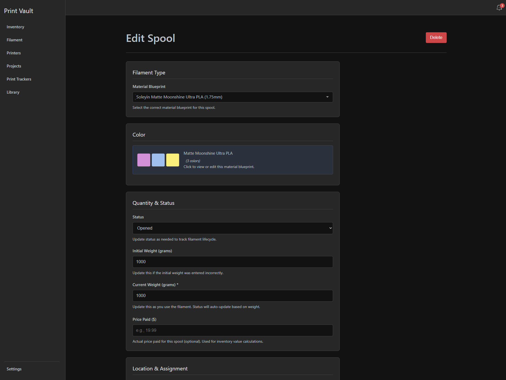](images/fil3a.png)

[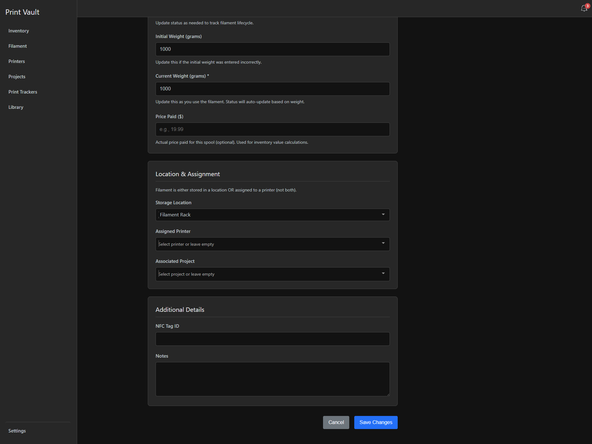](images/fil3b.png)

A red **Delete** button sits at the top of the page.

---

## Managing Spool Batches

If a spool is still an **unopened batch** (Status = New/Unopened, Quantity greater than 1) and you change its Status to Opened, In Use, or Low, a **Manage Spools in Batch** window opens instead of saving immediately. It lists each spool in the batch by number, with its own Status and a combined Location/Printer dropdown per row — letting you split one "3 spools" batch into individually tracked spools with different locations or printers (e.g. one goes onto a printer, two stay on the shelf). Confirming applies your per-row choices and converts the batch into individual spool records; Cancel reverts the Status change.

> 📷 **Screenshot needed** — the Manage Spools in Batch modal

---

## Filtering and Searching

Click **Filter** on any tab to narrow the table:

- **Spools tab**: Status, Brand, Base Material, Color Family, Feature
- **Blueprints / Generic Materials tabs**: Brand, Base Material, Color Family

The **Search** box does a live text search, and **Columns** lets you choose which table columns are shown (for Spools: Photo, Brand, Colors, Name, Material, Features, Quantity, Status, Location/Printer, Filament Used; for Blueprints: Favorite, Photo, Brand, Name, Colors, Material, Color Family, Diameter). The Favorite column shows a ★ for any Blueprint you've favorited — it's read-only here; toggle it from the Blueprint's own detail page (see [The Material Detail View](#the-material-detail-view)).

[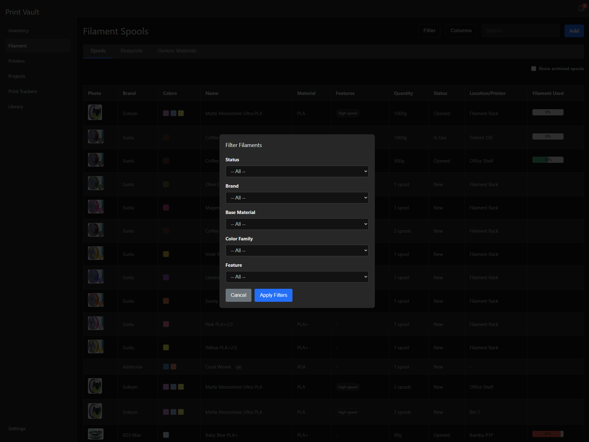](images/fil4.png)

---

## Dashboard Widgets

The Dashboard's **Filament Management** section shows three cards, with a **View All Spools** button linking back to `/filaments`:

- **⚠️ Low Stock Materials** — Blueprint materials whose available stock has dropped below their configured Low Stock Threshold, with brand/name and current spool count
- **🖨️ In Use** — spools currently assigned to a printer (Status = In Use), with a color swatch and the assigned printer
- **⭐ Favorites** — your favorited Material Blueprints, with brand/name and spool count

> 📷 **Screenshot needed** — the Dashboard's Filament Management widgets

---

## Color and Material Basics

Every color on a Blueprint or a Quick Add spool is stored as one or more hex values plus a **Color Family** (one of 13 groupings) for filtering — there's no separate per-spool color field; a Blueprint-based spool's color always comes from its blueprint.

Print Trackers pull directly from this same Material library for their per-file Primary/Accent Material and color assignment — see **Print Tracker Guide → [Color and Material Basics](PRINT_TRACKER_USER_GUIDE.md#color-and-material-basics)** for how a Blueprint's color and material type feed into a tracker's clickable material tags.

---

## Common Use Cases

### Setting Up a Filament Brand You Buy Regularly

1. From the **Blueprints** tab, click **Add**, choose **Blueprint (Brand-Specific Filament)**.
2. Fill in Name, Brand, Base Material Type, diameter, color(s) and Color Family, and any print settings/vendor info you know.
3. Click **Save & Add Spool** to immediately log your first physical spool against it.
4. Next time you buy the same filament, open the blueprint's detail page and click **Create Spool** rather than filling out the spec sheet again.

### Adding a One-Off Spool You Don't Want a Blueprint For

1. From the **Spools** tab, click **Add**, and choose **Quick Add**.
2. Fill in Name, Material Type (pick from your Generic Materials list), and color.
3. Save — no Blueprint is created, and this spool won't show up under any Material's spool list since it isn't tied to one.

### Tracking a Spool from Full to Empty

1. Create the spool as **Unopened**, quantity as bought.
2. When you open one, edit it and switch Status to **Opened** — if it was part of a multi-quantity batch, the **Manage Spools in Batch** window lets you peel off just the one you opened.
3. As you print, periodically update **Current Weight**; Status moves through **In Use** → **Low** automatically based on remaining percentage.
4. Once it hits 0g, set Status to **Empty**, then **Archived** when you're done with it for good.

---

## Tips

- Use **Features** tags on Blueprints (matte, high-speed, glitter, silk) to keep specialty filaments searchable without cluttering the Color Family field.
- **Save & Clone** on a Blueprint is the fastest way to add a new color of a filament you already have specced out — most fields carry over, you just adjust color and name.
- Keep **Empty Spool Weight** filled in on your Blueprints; it's what makes the Weight & Quantity remaining-percentage bar on each spool accurate.
- A spool can be in a **Storage Location** or **assigned to a Printer**, never both — assigning a printer is how a spool shows up on the Dashboard's "In Use" widget.
- Use **Generic Materials** (Settings → Materials) sparingly as a curated base list — every Blueprint's Base Material Type and every Quick Add spool's Material Type pulls from it, so a tidy list keeps those dropdowns useful.
- **Favorite** the (up to 5) Blueprints you buy most often via the ☆/★ toggle on their detail page — they'll show a ★ in the Blueprints list and populate the Dashboard's Favorites widget for quick access.

---

## Related Sections

- **Print Trackers** — per-file Primary/Accent Material and color assignment pulls directly from your Material Blueprints; see [Color and Material Basics](PRINT_TRACKER_USER_GUIDE.md#color-and-material-basics)
- **Inventory** — general parts and supplies tracking, separate from spool-level filament tracking
- **Projects** — associate a spool with a Project via its Location & Assignment section
- **Settings → Materials** — manage the master list of Generic base material types
