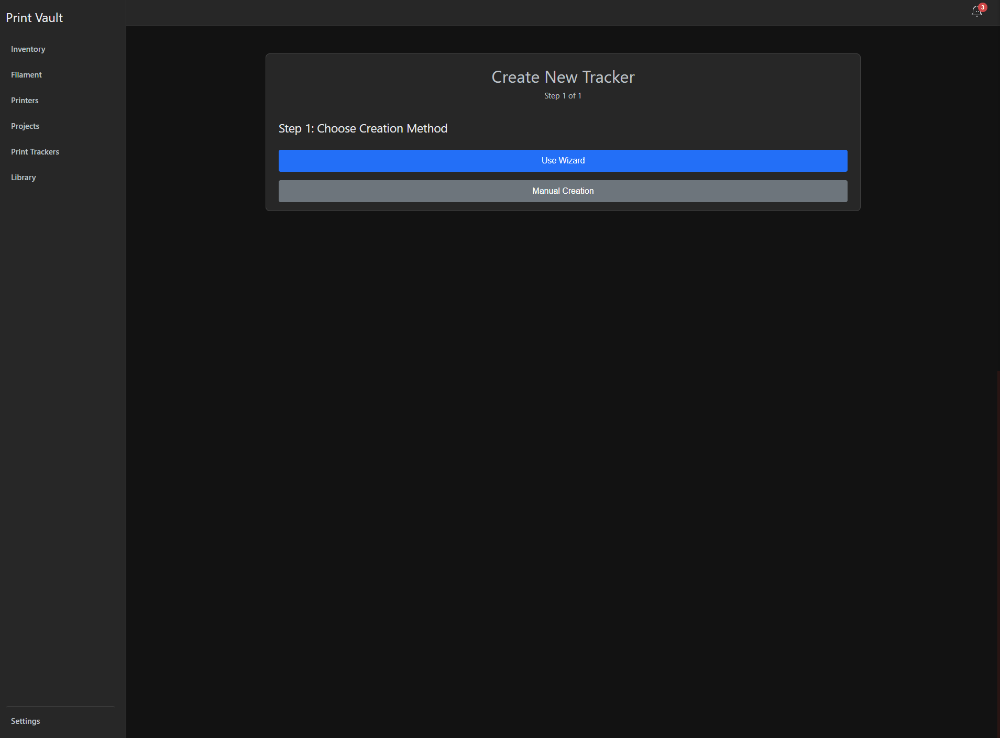
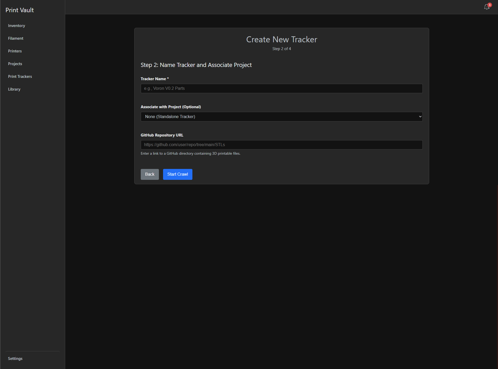
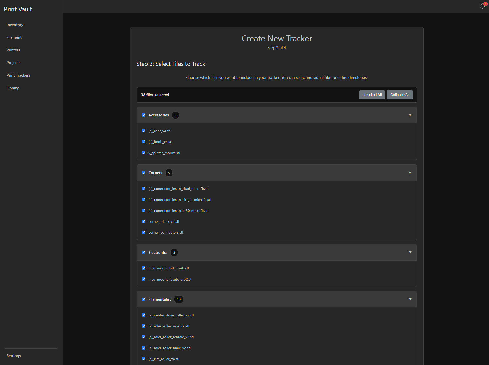
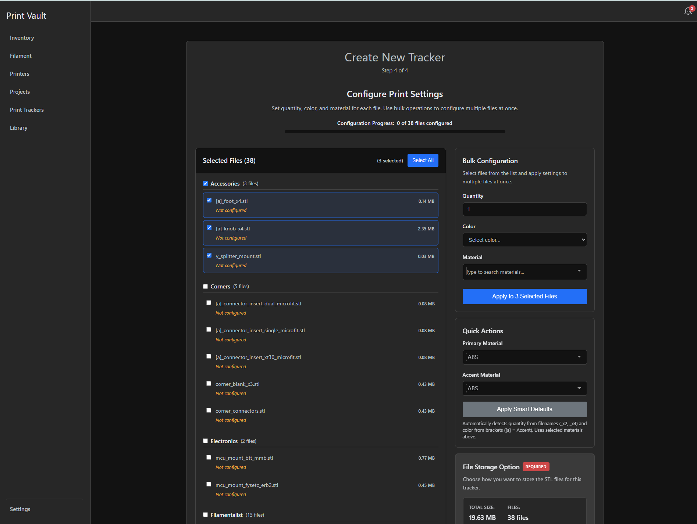
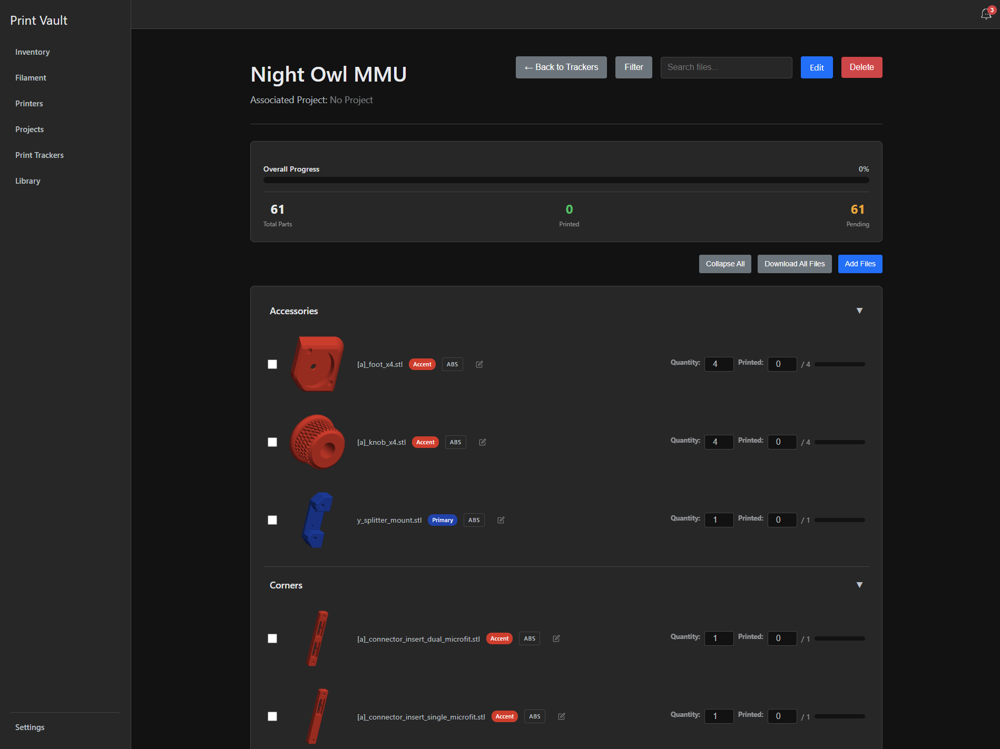
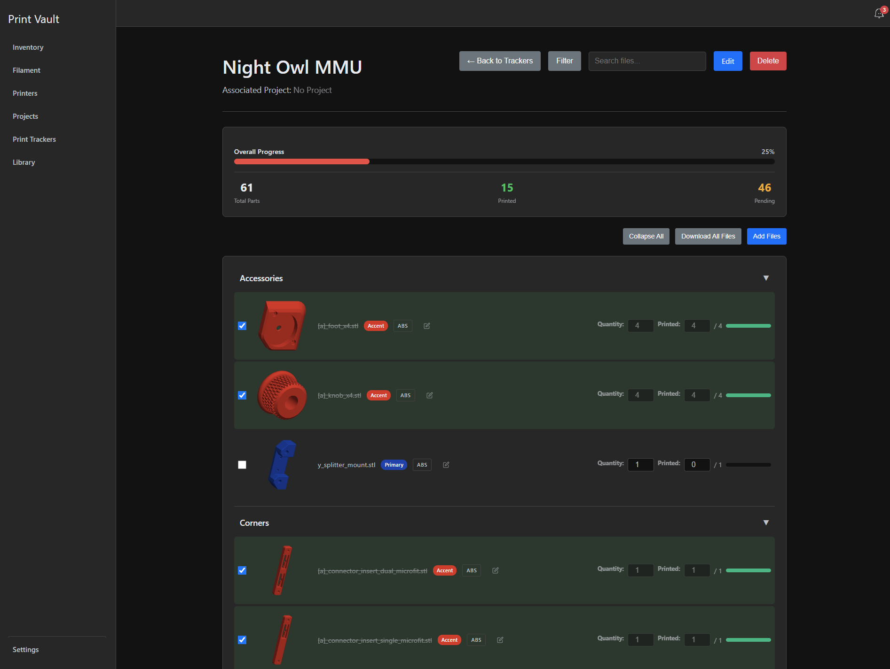
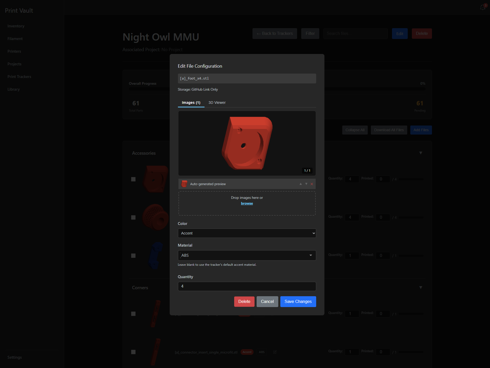
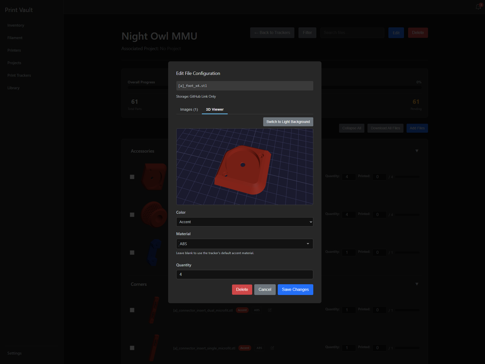
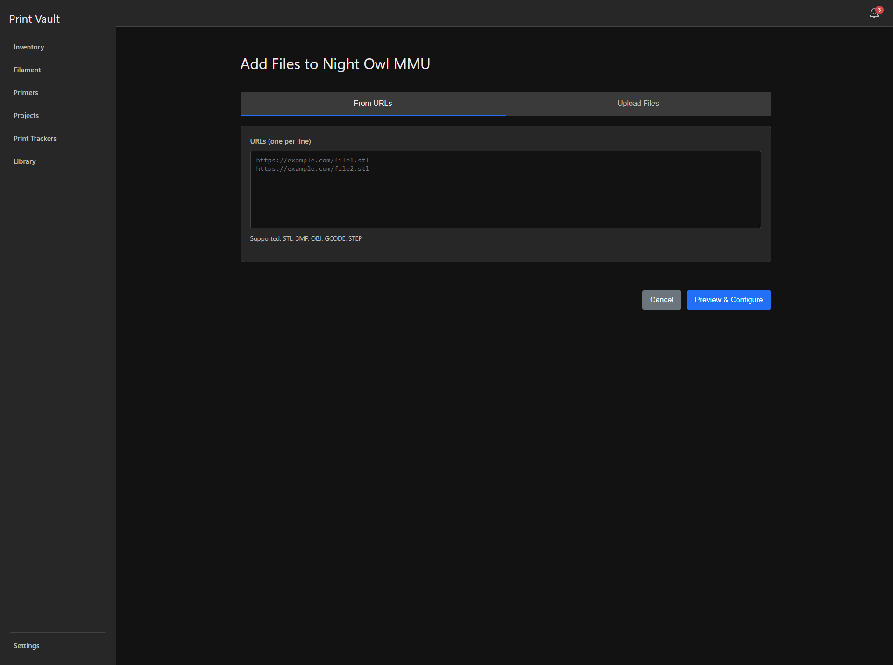
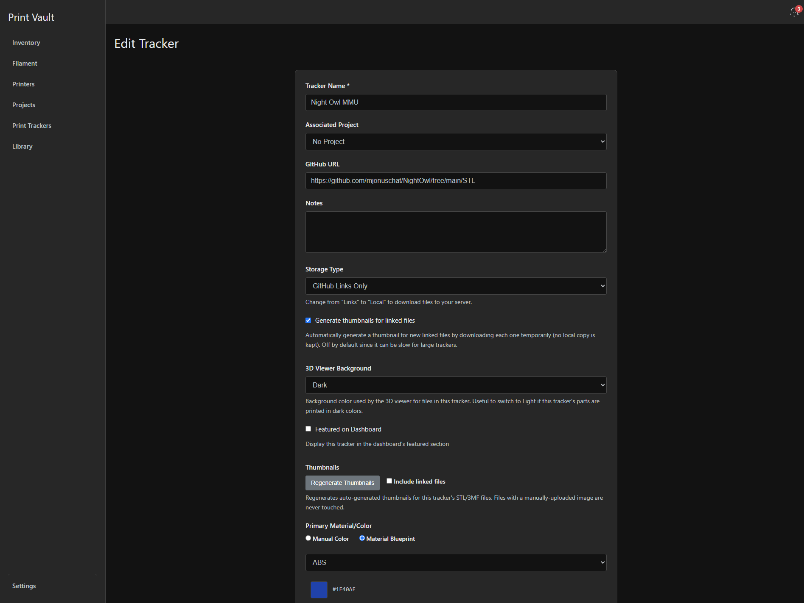

# Print Tracker Guide

**Print Vault** — User Documentation
**Feature**: Print Tracker
**Last Updated**: 2026-07-08

---

## What Is the Print Tracker System?

The Print Tracker system manages multi-file 3D printing projects that require dozens or hundreds of separate STL, 3MF, or OBJ files. Whether you're building a Voron printer, a Box Turtle MMU, or a custom robot, Print Tracker gives you a single place to select files, configure color/material/quantity per file, and track which ones you've actually printed.

Core capabilities:

- Crawl a GitHub repository URL to auto-discover all printable files (`.stl`, `.3mf`, `.obj`), preserving the original directory structure
- Two creation modes: **Use Wizard** (GitHub URL crawl) or **Manual Creation** (paste arbitrary URLs and/or upload local files, organized into your own categories)
- Choose storage: **Links Only** (store the source URL, stream/download on demand) or **Local** (download every file to the Print Vault server immediately)
- Per-file configuration: **Color** (Primary / Accent / Multicolor / Clear / Other), **Material** (a Material Blueprint from your filament library, e.g. ABS/PLA/PETG), and **Quantity** needed
- **Smart Defaults** that auto-detect quantity from filename suffixes like `_x2`/`_x4` and color from a `[a]` bracket prefix meaning Accent
- Optional association with a Project, or keep a tracker standalone
- Per-file progress tracking (Not Started / In Progress / Completed) with printed-vs-required counters and progress bars
- Auto-generated 3D thumbnail previews for STL/3MF files, plus a built-in interactive 3D Viewer

> **Note**: Print Trackers are a different feature from **Library**. Library indexes STL/3MF files already sitting on your disk or a network share so you can browse them. Print Tracker is for actively working through a specific build's file list with per-file print progress.

---

## Getting Started

Open **Print Trackers** from the sidebar (route `/trackers`). The list page lets you search and filter existing trackers by project. Click the create button in the header to start a new one — this takes you to `/trackers/create`.

The wizard opens on **Step 1: Choose Creation Method**, with two options:

- **Use Wizard** (blue) — crawl a GitHub repository
- **Manual Creation** (gray) — paste URLs and/or upload files yourself

---

## Creating a Tracker

Pick the path that matches where your files live:

- **Option A — GitHub Wizard**: best when all your files live in one GitHub repository. A 4-step flow: Choose Method → Name/Project/URL → Select Files → Configure Files.
- **Option B — Manual Creation**: best when you're uploading your own STL files from your computer, or pulling from a source that gives you a direct link to the file itself. Sites like Printables, Thingiverse, and MakerWorld generally don't expose a direct file URL — for those, download the file to your computer first and upload it instead. A 5-step flow: Choose Method → Basic Info → Add Files → Configure Files → Review & Create.

### Option A — GitHub Wizard

**Step 2: Name Tracker and Associate Project**

- Fill in **Tracker Name \*** (required, e.g. "Voron V0.2 Parts")
- Optionally pick a project from **Associate with Project (Optional)** (defaults to "None (Standalone Tracker)")
- Paste your repo link into **GitHub Repository URL** — a link to a GitHub directory containing 3D printable files
- Click **Start Crawl** (or **Back** to return)

If the crawl fails, an inline alert explains why — common causes are an invalid/not-found repository, a GitHub rate limit (add a personal access token in Settings to raise the limit), or no printable files found at that path.

**Step 3: Select Files to Track**

- Files appear grouped into collapsible directory cards, each with a file-count badge, a checkbox to select/deselect the whole directory, and individual file checkboxes
- The summary bar at the top shows **{N} files selected**, plus **Select All / Unselect All** and **Collapse All / Expand All** toggles
- Files over 10 MB show a yellow "large file" warning badge; files over **100 MB are blocked outright** — their checkbox is disabled and they can't be selected
- Click **Next: Configure Files** (disabled until at least one file is selected)

**Step 4: Configure Print Settings**

This screen sets quantity, color, and material for each file, and finishes tracker creation:

- A **Configuration Progress: X of N files configured** bar tracks how many files still need setup
- The left panel lists **Selected Files** by directory; each shows filename, size, and a "Not configured" label until you set it
- The right panel's **Bulk Configuration** box lets you check files on the left, then set **Quantity**, **Color** (Primary/Accent/Multicolor/Clear/Other), and **Material** (type-to-search), and click **Apply to N Selected Files**
- **Quick Actions** offers a faster path: pick a **Primary Material** and **Accent Material**, then click **Apply Smart Defaults** — this auto-detects quantity from filename suffixes (`_x2`, `_x4`) and color from `[a]` brackets (Accent), applying it to every currently selected file at once
- **File Storage Option** (marked REQUIRED) is where you pick **Store File Links** (Links Only) or **Download and Store Locally** (Local) — see [Storage Options](#storage-options) below. A running **TOTAL SIZE** / **FILES** count is shown alongside it
- If you chose **Store File Links**, a **Generate thumbnails for linked files** checkbox appears. Turning it on renders a preview thumbnail for each linked file by downloading it temporarily (no local copy kept) — it's off by default and can take a while on a tracker with many files. You can also turn it on later from [Edit Tracker settings](#editing-tracker-settings)
- Click **Create Tracker** (disabled until a storage option is chosen). If you picked **Download and Store Locally**, a download progress modal appears while files are fetched to the server before you land on the tracker's page

### Option B — Manual Creation

**Step 2: Basic Information**

- Fill in **Tracker Name \*** (required)
- Optionally pick **Associate with Project (Optional)**
- Click **Next: Add Files** (disabled until a name is entered)

**Step 3: Add Files**

- Click **Import URLs** or **Upload Files** to open the corresponding modal
- **Import URLs**: paste one URL per line (supported: STL, 3MF, OBJ, GCODE, STEP), pick or type a category name, then preview. Each line is validated as a proper `http(s)` URL with a supported extension, with per-line errors shown
- **Upload Files**: drag-and-drop or browse for local files from your computer, then assign a category
- Both end in a **Preview & Configure** step before files are added to your running list
- Files appear grouped by category as collapsible cards, mirroring the GitHub wizard's directory-card look. Each row shows the filename, a source badge (e.g. "Upload" or the URL's host), and a delete (×) button; whole categories can be deleted too
- Click **Next: Configure Files** once at least one file is added

> **Note**: Import URLs needs a direct link to the file itself. Sites like Printables, Thingiverse, and MakerWorld typically don't expose one — their download buttons are gated behind JavaScript/auth, not a plain file URL. For those sources, download the file to your computer first and use **Upload Files** instead.

> 📷 **Screenshot needed** — Step 3 (Add Files): the Import URLs and Upload Files modals

**Step 4: Configure Files**

Same **Bulk Configuration**, **Quick Actions**, and **Apply Smart Defaults** workflow as the GitHub Wizard's Step 4. One difference: **File Storage Option** is only required if at least one file was added via URL — upload-only trackers don't need a storage choice, since there's nothing to link.

**Step 5: Review & Create**

- A read-only summary card shows **Name**, **Project**, **Storage Type**, **Total Files**, and **Categories**
- Below it, the full file list is shown by category with each file's color badge, material badge, and quantity
- Click **Create Tracker** to finish. Uploaded files are sent to the server after the tracker record is created, so expect a short delay before you land on the tracker's page

> 📷 **Screenshot needed** — Step 5: Review & Create summary screen

---

## The Print Tracker View

This is your main workspace once a tracker exists — reached by creating one or clicking into it from the Print Trackers list.

- The header shows the tracker name, **Associated Project: {name}** (or "No Project"), and action buttons: **Back to Trackers**, **Filter**, a **Search files...** box, **Edit** (blue), **Delete** (red)
- An **Overall Progress** card shows a percentage bar and three stats: **Total Parts**, **Printed**, **Pending**
- Below that: **Collapse All**, **Download All Files** (zips every currently-accessible file), and **Add Files** (blue) buttons
- Files are grouped into collapsible category sections named after their source directory (e.g. "Accessories", "Corners")
- Each file row shows a checkbox, a thumbnail slot, the clickable filename, a color badge (blue for Primary, amber/orange for Accent, gradient for Multicolor, light gray for Clear, warm gray for Other), one or more material tags, an edit (pencil) icon, and on the right: a **Quantity** input, a **Printed** counter with − / + buttons and a manual number field, a "/ N" required amount, and a small progress bar

> **Note**: A material tag is only clickable (linking to that Material's detail page) when it's a saved **Material Blueprint** from your filament library. A plain generic material type (e.g. "ABS" not tied to a blueprint) shows as a tag but isn't clickable — see [Color and Material Basics](#color-and-material-basics).

---

## Marking Progress

Two independent controls on each file row track production:

- **Checkbox** — checking it instantly marks the file **Completed**: the filename gets a strikethrough, the row highlights green, and the Quantity/Printed controls lock. Unchecking it reverts the file and unlocks the controls.
- **Printed counter** — use the − / + buttons or type directly into the field to log partial progress without marking the file fully complete. This is how **In Progress** status is recorded. The value is clamped between 0 and the file's **Quantity**.

**Quantity** itself is also directly editable per file (not just during bulk configuration) — useful if your build needs more or fewer copies than originally planned.

The three underlying statuses:

| Status | Meaning |
|---|---|
| **Not Started** | 0 printed |
| **In Progress** | Some printed, but not all, or manually set |
| **Completed** | Checkbox checked |

The tracker-level **Overall Progress** bar and **Printed**/**Pending** stats recalculate automatically as you update individual files.

---

## Filtering and Searching Files

- The **Search files...** box in the header does a live text search across filenames as you type
- Clicking **Filter** opens a "Filter Files" modal with:
  - **Color** — All / Primary / Accent / Multicolor / Clear / Other
  - **Material** — All, or dynamically populated from materials used in this tracker
  - **Status** — All / Not Started / In Progress / Completed
  - A **"Show only files missing configuration"** checkbox — surfaces files still missing a color or material. These files also show a small ⚠️ warning icon next to their filename in the main list at all times, not just while filtering
- Modal buttons: **Remove Filters** (shown only when a filter is active), **Cancel**, **Apply Filters**

---

## Editing a File's Configuration

Click the pencil icon on a file row (or click its thumbnail) to open the **Edit File Configuration** modal. The header shows the filename and a **Storage: GitHub Link Only / Local File** label.

Two tabs live inside the modal:

- **Images (N)** — a carousel of preview images with a counter, up/down reorder arrows, and an × to delete. System-generated previews are captioned "Auto-generated preview." A drop zone labeled "Drop images here or **browse**" lets you upload your own
- **3D Viewer** — see [Auto-Generated Thumbnails and the 3D Viewer](#auto-generated-thumbnails-and-the-3d-viewer) below

Below the image area: **Color** dropdown, **Material** dropdown (helper text reminds you to leave it blank to use the tracker's default Primary/Accent material, when applicable), and **Quantity**.

Footer buttons: **Delete** (red, removes the file from the tracker entirely), **Cancel**, **Save Changes** (blue).

---

## Auto-Generated Thumbnails and the 3D Viewer

Print Vault automatically renders a thumbnail preview for STL/3MF files shortly after they're added:

- For **locally stored** files, this always happens
- For **link-only/GitHub** files, it only happens if **"Generate thumbnails for linked files"** is turned on — you can set this the first time during tracker creation (Configure Print Settings, next to your storage choice) or later from [Edit Tracker settings](#editing-tracker-settings). Either way, it works by downloading each linked file temporarily (no local copy kept), which is why it's off by default and can take a while on a tracker with many files
- Auto-generated thumbnails are captioned "Auto-generated preview" and colored to match the file's assigned Primary/Accent/material color
- If you manually upload your own image for a file, auto-generation will never overwrite it

The **3D Viewer** tab (in the same Edit File Configuration modal) renders an interactive, rotatable preview of the actual file geometry, not just a static image. Use **Switch to Light Background** / **Switch to Dark Background** if a dark-colored part is hard to see against the viewer's background (or vice versa). This is a per-viewing-session toggle — the tracker-wide default background is set separately in [Editing Tracker Settings](#editing-tracker-settings).

---

## Adding Files to an Existing Tracker

Click **Add Files** from the tracker detail page toolbar. This opens an "Add Files to {Tracker Name}" page with the same two tabs as Manual Creation:

- **From URLs** — a textarea labeled "URLs (one per line)" (supported: STL, 3MF, OBJ, GCODE, STEP)
- **Upload Files** — drag-and-drop / browse for local files

Click **Preview & Configure** to move to category assignment and the same bulk color/material/quantity configuration used elsewhere, or **Cancel** to back out. New files merge into the tracker's existing categories, or create a new one if you type a new category name.

> Same caveat as Manual Creation: **From URLs** needs a direct file link. For Printables, Thingiverse, MakerWorld, and similar sites, download the file first and use **Upload Files** instead.

---

## Editing Tracker Settings

Click **Edit** on the tracker detail page to open the **Edit Tracker** form:

- **Tracker Name \***, **Associated Project**, **GitHub URL**, **Notes**
- **Storage Type** — "GitHub Links Only" or Local; switching from Links to Local downloads any not-yet-local files
- **Generate thumbnails for linked files** — off by default since it can be slow for large trackers (it downloads each linked file temporarily to render a preview, keeping no local copy)
- **3D Viewer Background** — Dark or Light; sets the tracker-wide default background for the 3D Viewer, useful if this tracker's parts are printed in dark colors
- **Featured on Dashboard** — displays this tracker in the dashboard's featured section
- **Thumbnails** — a **Regenerate Thumbnails** button (with an "Include linked files" checkbox) rebuilds auto-generated thumbnails for the tracker's STL/3MF files; files with a manually-uploaded image are never touched
- **Primary Material/Color** and **Accent Material/Color** — each has a **Manual Color** / **Material Blueprint** radio toggle. Manual Color lets you pick a plain hex value; Material Blueprint lets you pick one of your saved filament materials, which carries that material's actual color

Save persists all changes.

---

## Storage Options

| | Links Only | Local |
|---|---|---|
| **Where files live** | Stay on GitHub/the original host; nothing is downloaded to the server | Every file is downloaded to the Print Vault server |
| **Creation speed** | Instant | Slower — a download progress modal shows while files fetch |
| **Long-term access** | Requires the source URL to stay valid and internet access to view/download later | Files remain accessible even if the original repo or URL goes offline |
| **Server disk usage** | Minimal | Uses server disk space proportional to file sizes |

> **Risk with Links Only**: a linked file only works as long as its source URL keeps working. If a GitHub repo gets restructured, renamed, moved to a new release/tag, or taken down entirely, every link into it breaks — silently, until you try to open or download the file. This isn't hypothetical: repo maintainers moving to a new project version can and do orphan old STL links. If you're printing a build over weeks or months, consider Local storage (or switch to it later) so your files don't depend on the source repo staying put.

You can switch a tracker from Links Only to Local later via [Editing Tracker Settings](#editing-tracker-settings) — this triggers downloads for any file not already stored locally.

**Download All Files** on the tracker detail page zips up whatever is currently accessible: local files are always included, and linked files are fetched live at download time (so they need a working internet connection and a still-valid source URL).

---

## Color and Material Basics

Print Tracker uses five color slots to organize which filament goes where — **Primary**, **Accent**, **Multicolor**, **Clear**, **Other**. These are just labels for your own workflow; they don't need to match your printer's actual AMS/MMU slot names.

- **Primary** and **Accent** are your build's two main colors
- **Multicolor** is for a file that needs more than two colors
- **Clear** is for transparent/see-through parts
- **Other** is a catch-all

**Material** can be set two ways:

- Pick one of your saved **Material Blueprints** from your filament library — each carries both a material type (ABS, PLA, PETG, etc.) and a specific color. Files using a blueprint get a clickable material tag linking to that blueprint's detail page, and its color feeds the badge for Primary/Accent files.
- Pick a plain **generic material type** (shown when a matching blueprint doesn't exist yet) — this just labels the file with a material name, with no linked color or detail page, so its tag isn't clickable.

Creating a Material Blueprint for the types you use most gets you clickable, color-accurate tags throughout the tracker instead of plain text labels.

You can set a tracker-wide default **Primary Material** and **Accent Material** in [Edit Tracker settings](#editing-tracker-settings). Files marked Primary/Accent use that color/material by default, and you can still override color, material, or quantity on any individual file.

---

## Common Use Cases

### Tracking a Voron Build from GitHub

1. From the Print Trackers list, click the create button and choose **Use Wizard**.
2. On Step 2, name the tracker and paste the Voron GitHub STL folder URL into **GitHub Repository URL**, then click **Start Crawl**.
3. On Step 3, leave everything selected (or deselect anything you don't need) and click **Next: Configure Files**.
4. On Step 4, set **Primary Material** and **Accent Material** to ABS under Quick Actions and click **Apply Smart Defaults**. Choose **Local** as the storage option, since you'll be printing over several weeks and want the files to survive if the source repo changes. Click **Create Tracker**.

### Building from Downloaded Printables/Thingiverse Files

Sites like Printables, Thingiverse, and MakerWorld don't give you a direct file URL to paste — you have to download the files yourself first.

1. Download the STL/3MF files you need from the source site to your computer.
2. Choose **Manual Creation**, enter a tracker name on Step 2, and continue to Step 3.
3. Click **Upload Files** and drag in what you downloaded, organizing them into categories per subassembly (e.g. "Frame", "Extruder", "Fan Shroud"). Use **Import URLs** only for any files you have a direct link to (e.g. a raw GitHub link or a direct file host).
4. Configure colors/materials on Step 4, review on Step 5, and click **Create Tracker**.

### Multi-Session Printing with Partial Batches

For a file with **Quantity** 8:

1. Print 3 today — click the **+** button on the Printed counter three times (or type `3` directly) to record it.
2. Come back next week and print 3 more, updating the counter again.
3. Finish the last 2, then check the file's checkbox to mark it **Completed**.

---

## Tips

- Treat the 100 MB file-size block as a signal to check whether a file really needs to be that dense, or whether the source repo has an oversized mesh.
- Only enable **Generate thumbnails for linked files** on smaller trackers — it downloads every linked file temporarily just to render a preview.
- Run the "missing configuration" filter right after a GitHub crawl to make sure nothing was missed before you start printing.
- Standalone trackers (no project) are fine for one-off prints; associate with a Project when you want a build's tracker to live alongside that project's BOM and other assets.
- If parts are printed in very light or very dark filament, flip the 3D Viewer background per-file, or set the tracker-wide default in Edit Tracker settings if most files share that issue.

---

## Related Sections

- **Library** — indexing/browsing STL and 3MF files already on disk or a network share
- **Projects** — associate a tracker with a project to keep a build's files and its BOM together
- **Filament / Materials** — the material library that Print Tracker's colors and materials pull from
